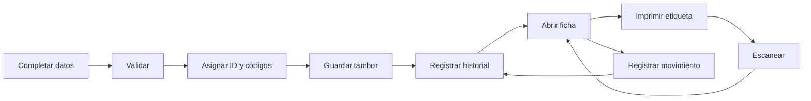

# 03 - Flujos y reglas del negocio

[[Olivícola Luján/00 - Índice general|← Volver al índice general]]

## Ciclo principal

## Alta

Seleccionar valores activos de los catálogos y completar lote, ingreso y peso. El sistema calcula `nextTamborId` usando tambores e historial para no reutilizar números de registros eliminados. Construye el código descriptivo y el completo, guarda el tambor, registra «Tambor creado» y abre la ficha.

## Edición

Se preserva `tambor_id`. Se validan los datos, reconstruyen los códigos y comparan los campos de negocio. Por cada campo distinto se agrega un evento con `campo`, `valor_anterior` y `valor_nuevo`. Las opciones inactivas ya asignadas pueden mantenerse al editar. Cambiar un catálogo puede alterar el código al volver a guardar un tambor; no se actualizan las etiquetas físicas automáticamente.

## Movimiento

Desde la ficha se elige un tipo activo y una ubicación activa, con observaciones opcionales. La implementación también permite cambiar el estado. Se crea `Movimiento`, se registra el evento correspondiente y se actualiza ubicación y/o estado. Cada cambio de esos campos agrega su evento al historial.

## Eliminación

Se solicita escribir el número exacto del tambor. Se registra «Tambor eliminado» y se elimina el registro de `Tambor`; `Historial` y `Movimiento` permanecen. No hay restauración desde la interfaz. Los eventos actuales no contienen una fotografía completa de todos los datos al crear o eliminar, por lo que conservar eventos no permite reconstruir automáticamente una ficha íntegra.

## Escaneo

El lector USB debe enviar texto seguido de Enter. Se quitan espacios exteriores y se busca coincidencia exacta, sin distinguir mayúsculas, contra `tambor_id` o `codigo`. Si existe, se abre la ficha. Si no, se muestra el código desconocido, se limpia el campo y se devuelve el foco.

## Inventario y resumen

La búsqueda incluye ID, código, producto, variedad, calibre y lote, ignorando acentos. Los filtros cubren los siete catálogos del tambor. Los totales se calculan sobre los resultados filtrados. El dashboard resume todos los tambores, peso total y ubicaciones distintas ocupadas.

## Historial

Orden descendente por `created_date`, filtro por texto del número de tambor y consulta desde la ficha. Los valores de catálogo guardados en eventos son referencias; el nombre visible se obtiene del catálogo actual, no de una copia histórica del nombre.

## Límite de consistencia

La demo guarda el conjunto de entidades en una sola escritura local. La rama Base44 hace varias llamadas secuenciales sin transacción y puede quedar parcialmente guardada si una llamada falla. No existe una garantía distribuida de unicidad de `tambor_id`. Detalle en [[Olivícola Luján/11 - Riesgos y condiciones del piloto|11 - Riesgos y condiciones del piloto]].
