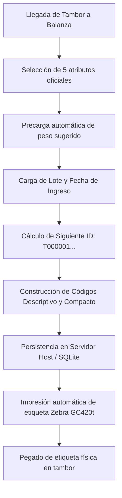
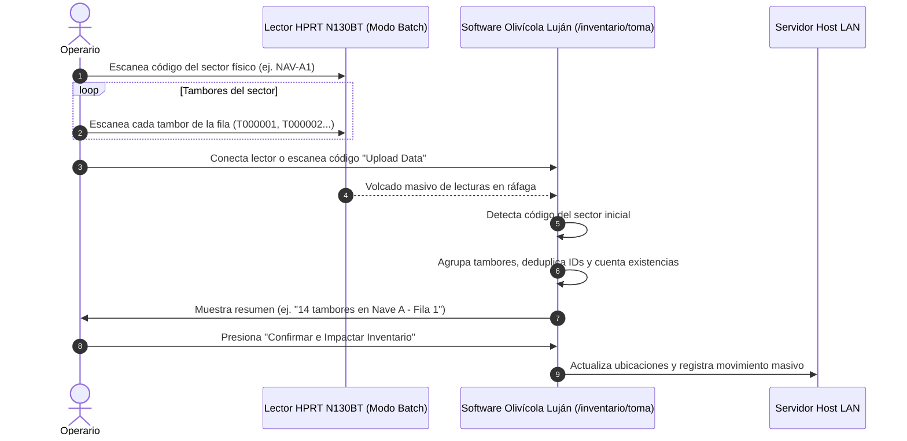

# 03 - Flujos y reglas del negocio

[[Olivícola Luján/00 - Índice general|← Volver al índice general]]

## 1. Flujo de Ingreso y Registro de Tambor (Balanza de Entrada)

### Reglas de Negocio:
1. **Unicidad de Tambor:** Cada tambor recibe un `tambor_id` estrictamente secuencial que nunca se repite ni se reasigna tras una baja.
2. **Estructura del Código Descriptivo:** Formado por `PRODUCTO-PRESENTACIÓN-VARIEDAD-CALIBRE-CALIDAD` (ej: `ENT-VDE-ALOR-121/140-PRI`).
3. **Estructura del Código Compacto:** Elimina guiones y barras para optimizar la densidad de barras en la etiqueta térmica (`ENTVDEALOR121140PRI`).
4. **Código Completo con Identificador:** `ENT-VDE-ALOR-121/140-PRI-T000001`. Permite saber exactamente qué producto contiene y qué tambor individual es.

---

## 2. Flujo de Toma de Inventario Físico por Sectores (Lector HPRT N130BT)

Diseñado específicamente para el trabajo ágil en los patios y naves de estiba:

### Reglas de Inventario:
1. **Detección de Sectores:** Si el código leído coincide con una ubicación del catálogo (ej. `NAV-A1`, `NAV-A2`, `PAT-B`), el sistema lo toma automáticamente como encabezado de sector.
2. **Deduplicación:** Si un mismo tambor fue escaneado varias veces por accidente en la misma fila, el sistema lo cuenta una sola vez gracias a su identificador único.
3. **Detección de Traslados:** Si un tambor registrado previamente en el Patio A es escaneado en la Nave B, el sistema actualiza automáticamente su ubicación y asienta el movimiento en el historial.

---

## 3. Flujo de Control de Calidad y Liberación de Lotes

1. El inspector de calidad accede al módulo exclusivo `/calidad`.
2. Selecciona el lote o tambor a inspeccionar.
3. Registra parámetros fisicoquímicos:
   - **pH:** Valor decimal (rango normal 3.2 - 4.2).
   - **Salinidad (%):** Concentración de salmuera.
   - **Temperatura (°C):** Temperatura del tambor.
   - **Acidez Libre:** Porcentaje de acidez titulable.
   - **Defectos / Observaciones:** Color, textura, aromas.
4. Dictamen:
   - **Liberado:** El tambor/lote queda disponible para calibrado o despacho comercial.
   - **En Observación / Retenido:** Se bloquea su movimiento o despacho hasta nuevo análisis.
   - **Rechazado:** Se envía a reproceso o descarte.

---

## 4. Flujo de Movimiento y Reubicación de Tambores

- Todo traslado de tambores entre Naves, Filas o Despacho genera un registro inmutable en la tabla de `Movimientos` y un evento en el `Historial`.
- Campos del movimiento: `tambor_id`, `ubicacion_anterior`, `ubicacion_nueva`, `estado_anterior`, `estado_nuevo`, `usuario`, `fecha` y `observaciones`.

---

## 5. Flujo de Baja de Tambores

- La eliminación está restringida a personal autorizado (Calidad o Administrador).
- Se requiere escribir el código visible completo (`T000001`) para confirmar.
- La baja elimina el tambor del inventario activo pero **conserva todos sus registros de auditoría y movimientos**, evitando huecos en la trazabilidad histórica de la planta.
