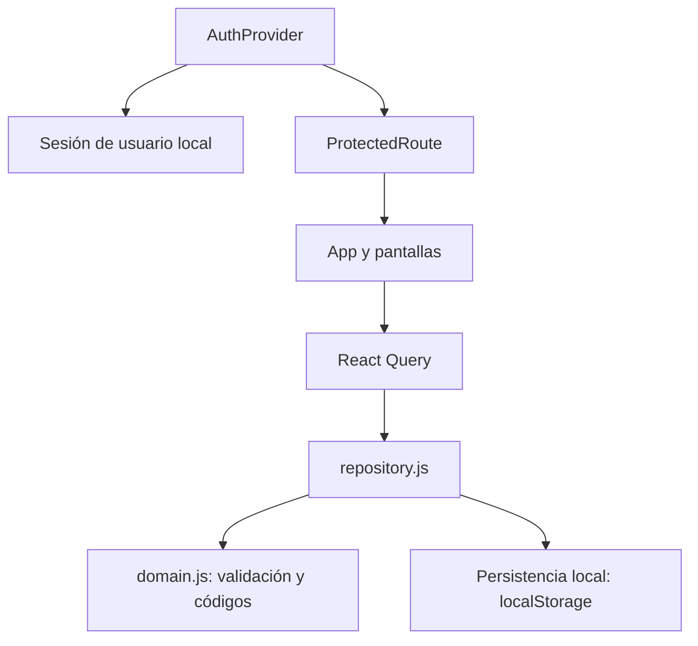

# 06 - Arquitectura y mapa del código

[[Olivícola Luján/00 - Índice general|← Volver al índice general]]

## Stack

| Capa | Tecnología | Uso |
|---|---|---|
| Interfaz | React 18, JSX y Vite ESM | Pantallas y compilación. |
| Estilos | Tailwind CSS y CSS propio | Tokens, mapeo de colores y diseño adaptable. |
| UI | Componentes de patrón shadcn con Radix, CVA y utilidades | Botón y diálogo en `src/components/ui/`. |
| Iconografía | lucide-react | Acciones y navegación. |
| Rutas | react-router-dom | Navegación y rutas protegidas. |
| Datos | TanStack React Query | Consulta, mutaciones e invalidación. |
| Etiquetas | jsbarcode | CODE 128 en SVG. |
| Persistencia | localStorage | Persistencia en el navegador por repositorio. |

Las versiones solicitadas están en `package.json`; las resueltas se fijan en `package-lock.json`. El proyecto aún no dispone de un despliegue remoto verificado.

## Flujo de dependencias

## Mapa del código

| Archivo o carpeta | Responsabilidad |
|---|---|
| `src/main.jsx` | Montaje, router, QueryClient y límite de errores. |
| `src/App.jsx` | Enrutamiento principal y estructura base con Layout. |
| `src/pages/` | Vistas y pantallas operativas de la aplicación. |
| `src/components/Auth.jsx` | Sesión, protección de rutas y selector de rol. |
| `src/components/Barcode.jsx` | SVG del código y generación del documento de impresión. |
| `src/components/ui/` | Botón y modal reutilizables. |
| `src/api/demoData.js` | Ejemplos iniciales y catálogos por defecto. |
| `src/api/repository.js` | Persistencia local, operaciones CRUD, auditoría y respaldo. |
| `src/lib/domain.js` | Reglas, validación, diferencias y búsqueda. |
| `src/lib/utils.js` | Composición de clases CSS y formateo. |
| `src/index.css` | Tokens y estilos de escritorio/móvil. |
| `tests/domain.test.js` | Pruebas unitarias de dominio. |
| `tests/repository.test.js` | Pruebas de integración del repositorio. |
| `tests/ui.test.jsx` | Pruebas de componentes de interfaz. |

## Rutas

| Ruta | Pantalla |
|---|---|
| `/` | Inicio y resumen. |
| `/escanear` | Lectura USB o manual. |
| `/inventario` | Listado, búsqueda y filtros. |
| `/historial` | Eventos globales. |
| `/configuracion` | Catálogos y respaldo. |
| `/tambores/nuevo` | Alta. |
| `/tambores/:id` | Ficha; `id` es el identificador técnico. |
| `/tambores/:id/editar` | Edición. |
| `/tambores/:id/etiqueta` | Etiqueta individual. |
| `/etiquetas` | Selección e impresión múltiple. |
| `/ayuda` | Guía rápida. |
| `/login`, `/register`, `/forgot-password`, `/reset-password` | Entrada al sistema y selector de rol. |

## Lectura y actualización

La consulta principal carga las entidades administradas. Tras una mutación exitosa se invalida la consulta principal en React Query. La caché considera frescos los datos durante 15 segundos.

Ver [[Olivícola Luján/12 - Pendientes y hoja de ruta|12 - Pendientes y hoja de ruta]].
