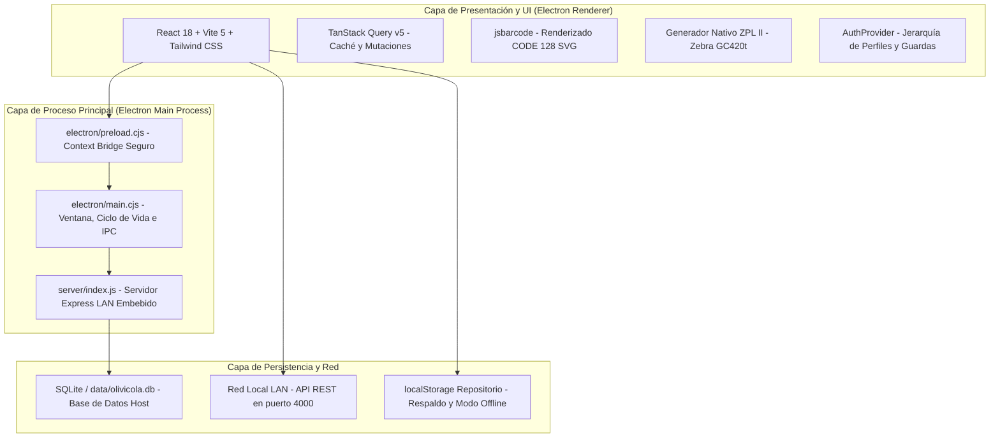

# 06 - Arquitectura y mapa del código

[[Olivícola Luján/00 - Índice general|← Volver al índice general]]

## Stack Tecnológico Integral

El sistema está construido como una solución desktop nativa de alto rendimiento con backend de sincronización LAN integrado:



### Detalle de Tecnologías:
- **Entorno de Escritorio:** Electron 33 (multiplataforma Windows x64 y macOS ARM64 Apple Silicon).
- **Frontend:** React 18, Vite 5, Tailwind CSS, Lucide React (iconografía técnica), Radix UI (primitivas de accesibilidad).
- **Gestor de Estado Asíncrono:** `@tanstack/react-query` con invalidación reactiva.
- **Códigos de Barra:** `jsbarcode` (renderizado SVG de CODE 128) y generador nativo ZPL II para impresoras industriales Zebra.
- **Backend Embebido:** Node.js con Express, arquitectura de endpoints REST (`/api/status`, `/api/tambores`, `/api/movimientos`, `/api/sync`) y soporte para base de datos SQLite persistente en disco del sistema.
- **Pruebas y Calidad:** Vitest con 7 archivos de pruebas y **96 tests unitarios y de integración**.
- **Portal de Distribución:** Vite SPA desplegado en **Vercel** (`portal/` en `https://portal-topaz-five-74.vercel.app`) para descarga pública de instaladores `.exe` y `.dmg`.

---

## Mapa de Archivos del Proyecto

```text
OlivicolaLujanTrazabilidad/
├── electron/
│   ├── main.cjs             # Proceso principal: gestión de ventana, arranque de Express y menús
│   └── preload.cjs          # Puente IPC seguro (window.electronAPI)
├── server/
│   ├── index.js             # Servidor backend Express para red LAN (puerto 4000)
│   ├── database.js          # Conexión y esquema SQLite (data/olivicola.db)
│   └── routes/              # Endpoints para tambores, catálogos, auditoría y usuarios
├── src/
│   ├── api/
│   │   ├── repository.js    # Capa de abstracción de datos: sincronización LAN, SQLite y fallback
│   │   └── demoData.js      # Catálogos oficiales del Excel y datos semilla
│   ├── components/
│   │   ├── Auth.jsx         # Contexto de autenticación, legajos, permisos y guardas
│   │   ├── Barcode.jsx      # Etiquetas físicas térmicas, calibración 100x50 mm y ZPL II
│   │   ├── Layout.jsx       # Barra lateral responsiva, firma de autoría Jairo López y atajos 1-7
│   │   └── ui/              # Componentes base (Button, Card, Dialog, Badge, Input)
│   ├── lib/
│   │   ├── domain.js        # Reglas de negocio: códigos compactos, validaciones y pesos
│   │   └── logger.js        # Registrador de eventos para la consola de diagnóstico
│   ├── pages/
│   │   ├── Dashboard.jsx        # Pantalla principal con estadísticas, accesos y modal de reportes PDF
│   │   ├── ScanPage.jsx         # Escaneo rápido continuo de tambores con HPRT N130BT
│   │   ├── InventoryPage.jsx    # Grilla de tambores, filtros y cálculo de kilos
│   │   ├── InventoryAuditPage.jsx # Toma física de inventario por sectores (Batch Mode)
│   │   ├── NewDrumPage.jsx      # Formulario de alta y pesaje con pesos sugeridos
│   │   ├── EditDrumPage.jsx     # Edición de características y control de cambios
│   │   ├── QualityPage.jsx      # Módulo exclusivo de Control de Calidad y liberación
│   │   ├── BatchLabelsPage.jsx  # Impresión múltiple y exportación de comandos ZPL
│   │   ├── HistoryPage.jsx      # Trazabilidad cronológica completa de eventos
│   │   ├── ConfigurationPage.jsx# Catálogos, red LAN, logs y personal
│   │   └── LoginPage.jsx        # Entrada segura por legajo y contraseña
│   ├── App.jsx              # Enrutador principal de React Router
│   └── main.jsx             # Punto de entrada del cliente React
├── portal/                  # Portal web público en Vercel para descarga de ejecutables
│   ├── public/              # versions.json, PDFs ejecutivos y ejecutables compilados
│   └── src/                 # Landing page con tabla de versiones y guías de instalación
├── scripts/
│   ├── build-win.cjs        # Script de compilación para Windows x64 (NSIS + Portable)
│   ├── build-mac.cjs        # Script de compilación para macOS ARM64 (DMG + ZIP)
│   ├── upload-release.cjs   # Automatización de subida a GitHub Releases
│   ├── generate_management_report.py # Generador PDF del Informe Ejecutivo (2 págs, balance 210.800 kg)
│   └── generate_management_manual.py # Generador PDF del Manual de Gerencia (4 págs, autoría Jairo López)
├── tests/                   # Suite de 96 pruebas automatizadas
│   ├── domain.test.js       # Pruebas de reglas de negocio, códigos y pesos
│   ├── architecture.test.js # Pruebas estructurales de componentes y dependencias
│   ├── hardware_adaptation.test.js # Pruebas de Zebra GC420t (ZPL II) y HPRT N130BT
│   ├── repository.test.js   # Pruebas de persistencia y aislamiento
│   ├── auth_security.test.jsx # Pruebas de seguridad, legajos y ocultamiento de roles
│   ├── ui.test.jsx          # Pruebas de renderizado, botón de reportes y firma de Jairo López
│   └── sync.test.js         # Pruebas de sincronización LAN Host / Cliente
└── package.json             # Versión activa v1.0.6 y configuración de Electron Builder
```

---

## Rutas del Sistema

| Ruta | Componente | Descripción y Permisos |
|---|---|---|
| `/` | `Dashboard` | Resumen operativo, indicadores de tambores y accesos directos (Atajo `1`). |
| `/escanear` | `ScanPage` | Foco constante para lector HPRT N130BT (Atajo `2`). |
| `/inventario` | `InventoryPage` | Tabla de tambores, filtrado multicriterio y exportación (Atajo `3`). |
| `/inventario/toma` | `InventoryAuditPage` | Toma masiva por sectores con escáner en modo memoria. |
| `/tambores/nuevo` | `NewDrumPage` | Alta y pesaje con pesos sugeridos oficiales (Atajo `4`). |
| `/tambores/:id` | `DrumDetailPage` | Ficha técnica individual y trazabilidad completa del tambor. |
| `/tambores/:id/editar`| `EditDrumPage` | Corrección de datos con registro en auditoría. |
| `/calidad` | `QualityPage` | Muestreo fisicoquímico y liberación de lotes (Atajo `5`). |
| `/etiquetas` | `BatchLabelsPage` | Impresión térmica masiva y generación ZPL II. |
| `/historial` | `HistoryPage` | Registro histórico inmutable de planta (Atajo `6`). |
| `/configuracion` | `ConfigurationPage` | Red LAN, catálogos, logs y personal (Atajo `7`, protegido). |
| `/login` | `LoginPage` | Inicio de sesión seguro con Legajo y Contraseña. |
