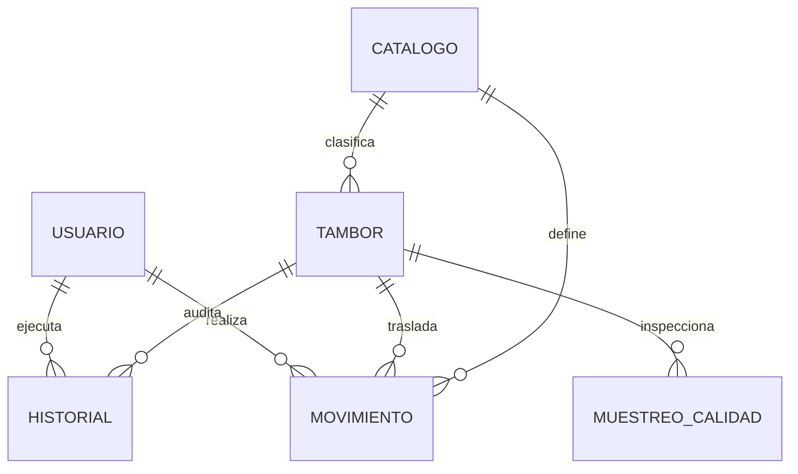

# 07 - Modelo de datos y catálogos

[[Olivícola Luján/00 - Índice general|← Volver al índice general]]

## Entidades Principales

El modelo de datos está estructurado alrededor de seis entidades normalizadas:

---

## 1. Entidad Tambor

Representa la unidad básica de almacenamiento en la planta (tambores de 140, 160 o 180 kg):

| Campo | Tipo | Significado y Reglas de Negocio |
|---|---|---|
| `id` | string | Identificador único técnico interno (ej. `tb-1727789012345`). |
| `tambor_id` | string | Identificador secuencial visible y permanente (ej. `T000001`). No se reasigna. |
| `codigo_descriptivo` | string | Código legible con 5 componentes (ej. `ENT-VDE-ALOR-121/140-PRI`). |
| `codigo_compacto` | string | Versión sin guiones ni barras (ej. `ENTVDEALOR121140PRI`), base oficial para **CODE 128**. |
| `codigo` | string | Código completo con ID: `ENT-VDE-ALOR-121/140-PRI-T000001`. |
| `producto` | string | ID del catálogo oficial (ej. `cat-prod-1` -> *Entera*). |
| `presentacion` | string | ID del catálogo oficial (ej. `cat-pres-1` -> *Verde*). |
| `variedad` | string | ID del catálogo oficial (ej. `cat-var-1` -> *Aloreña*). |
| `calibre` | string | ID del catálogo oficial (ej. `cat-cal-3` -> *121/140*). |
| `calidad` | string | ID del catálogo oficial (ej. `cat-calid-1` -> *Primera*). |
| `lote` | string | Código de lote del productor o molienda. Obligatorio. |
| `fecha_ingreso` | string | Fecha de pesaje/recepción (`YYYY-MM-DD`). |
| `fecha_elaboracion` | string | Fecha de cosecha/elaboración. Opcional (`<= fecha_ingreso`). |
| `peso` | number | Peso neto real en kilogramos medido en balanza. |
| `ubicacion` | string | ID del sector o fila actual (ej. `cat-ubi-1` -> *Nave A - Fila 1*). |
| `estado` | string | Estado del lote (ej. *En fermentación*, *Liberado*, *Observado*). |
| `observaciones` | string | Notas operativas o analíticas adicionales. |
| `created_date` | string | Timestamp ISO 8601 de creación en el sistema. |

---

## 2. Catálogos Oficiales de Gerencia (Excel Oficial)

Todos los valores de clasificación del software provienen del generador y catálogo oficial provisto por la Gerencia General de Olivícola Luján:

### A. Productos (`producto`) y Pesos Sugeridos Oficiales
| Nombre | Código | Peso Sugerido Oficial | Descripción |
|---|---|---|---|
| **Entera** | `ENT` | **180 kg** | Aceituna entera en salmuera tradicional. |
| **Descarozada** | `DES` | **140 kg** | Aceituna sin carozo. |
| **Rodajas** | `FET` | **160 kg** | Aceituna fileteada en rodajas / fetas. |
| **Griegas** | `GRI` | **180 kg** | Aceituna negra estilo griego arrugada. |
| **Rellenas** | `RELL` | **160 kg** | Aceituna descarozada rellena (pasta morrón u otros). |
| **Rotas** | `ROTA` | **160 kg** | Aceituna rota para pasta o descarte secundario. |

### B. Presentación / Color (`presentacion`)
| Nombre | Código | Nombre | Código |
|---|---|---|---|
| **Verde** | `VDE` | **Para Griega** | `P/GR` |
| **Negra** | `NN` | **Sin Carozo** | `S/C` |
| **Base** | `BAS` | **Con Pasta** | `C/P` |
| **Californiana** | `CALIF` | **Aceite** | `ACEITE` |
| **Clara** | `CL` | | |

### C. Variedades (`variedad`)
| Nombre | Código | Descripción de Variedad |
|---|---|---|
| **Aloreña** | `ALOR` | Tradicional de mesa, textura firme. |
| **Arauco** | `ARA` | Variedad insignia mendocina, gran calibre y sabor. |
| **Manzanilla Fina** | `MF` | Excelente textura y rendimiento. |
| **Picual** | `PIC` | Alto contenido de polifenoles y resistencia. |
| **Empeltre** | `EMP` | Típica aceituna negra de sabor dulce y maduro. |

### D. Calibres Oficiales (`calibre`)
| Calibre | Código | Calibre | Código |
|---|---|---|---|
| **Sin Calibre** | `SIN CAL` | **161/200** | `161/200` |
| **80/120** | `80/120` | **201/240** | `201/240` |
| **121/140** | `121/140` | **241/280** | `241/280` |
| **141/160** | `141/160` | **281/320** | `281/320` |
| **161/180** | `161/180` | **321/450** | `321/450` |
| **181/200** | `181/200` | | |

### E. Calidades (`calidad`)
- **Primera:** Código `PRI` (calidad de exportación y primera selección).
- **Segunda:** Código `SDA` (mercado interno selecto).
- **Tercera:** Código `TRA` (segunda selección o destino industrial).

---

## 3. Entidad Historial y Auditoría

Registra cronológicamente cada cambio que experimenta un tambor:
- `tambor_id`: Código visible del tambor.
- `tambor_ref`: ID técnico de enlace.
- `tipo`: *Creación*, *Edición*, *Movimiento*, *Pesaje*, *Calidad*, *Baja*.
- `campo`: Atributo específico alterado (ej. `peso`, `ubicacion`, `estado`).
- `valor_anterior` y `valor_nuevo`: Valores serializados antes y después del cambio.
- `actor`: Nombre y legajo del usuario que realizó la acción.
- `created_date`: Timestamp inmutable.

---

## 4. Entidad Movimiento

Registra los traslados físicos entre sectores de planta:
- `tambor_id`, `tipo_movimiento`, `ubicacion_anterior`, `ubicacion_nueva`, `estado_anterior`, `estado_nuevo`, `usuario`, `fecha` y `observaciones`.

---

## 5. Entidad Usuario y Control de Acceso

- `id`: Identificador único (`usr-operario-01`, etc.).
- `legajo`: Identificador de inicio de sesión (`OP-01`, `CAL-01`, `ADM-01`).
- `nombre`: Nombre y apellido del operario o supervisor.
- `password`: Contraseña almacenada en bóveda local segura.
- `rol`: `operario`, `calidad` o `admin`.
- `cargo`: Sector o puesto asignado (ej. *Balanza Entrada*, *Jefe de Planta*).
- `activo`: Booleano para inhabilitar accesos sin borrar el historial del empleado.
