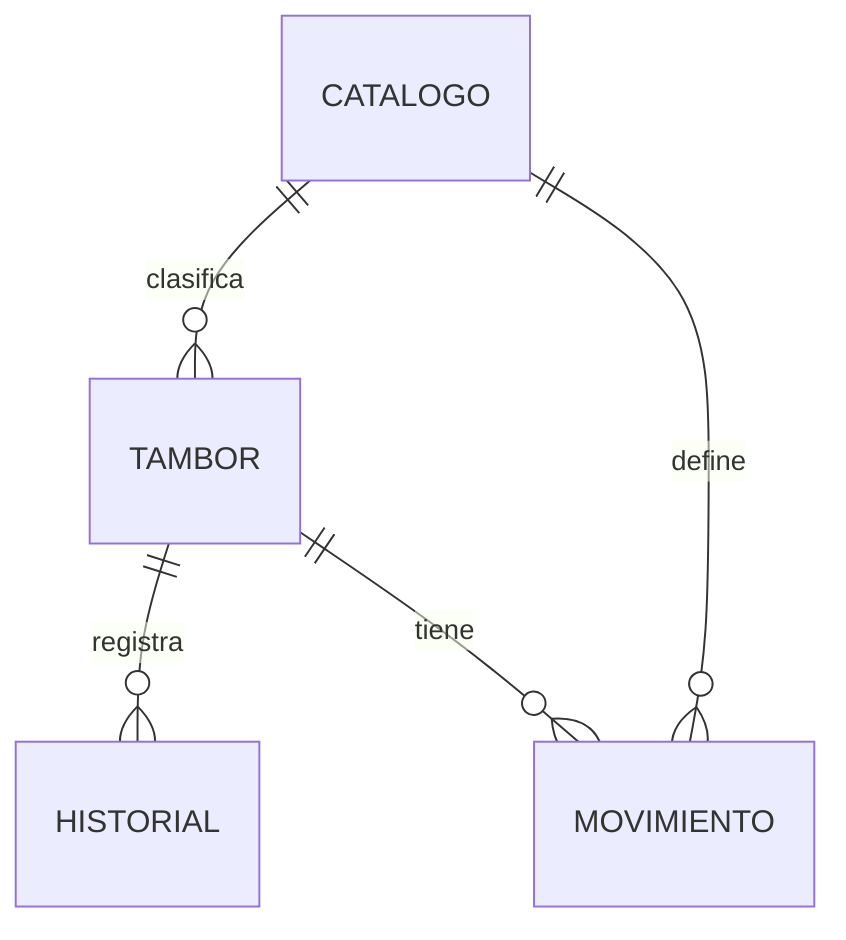

# 07 - Modelo de datos y catálogos

[[Olivícola Luján/00 - Índice general|← Volver al índice general]]

## Entidades

Las entidades del sistema corresponden a Tambor, Historial, Movimiento y Catálogo. Los identificadores `id` y las marcas temporales como `created_date` son campos generados automáticamente por el repositorio; no equivalen a `tambor_id`.

Las relaciones son lógicas mediante identificadores string. El diagrama no implica claves foráneas, borrado en cascada ni restricciones de base de datos ya configuradas.

## Tambor

| Campo | Tipo | Regla o significado |
|---|---|---|
| `id` | string | Identificador técnico del registro. |
| `tambor_id` | string | Número visible: `T000001` y siguientes. |
| `codigo_descriptivo` | string | Cinco componentes del producto. |
| `codigo` | string | Descriptivo más número de tambor. |
| `producto`, `presentacion`, `variedad`, `calibre`, `calidad` | string | IDs de opciones de catálogo. |
| `lote` | string | Obligatorio; se recortan espacios externos. |
| `fecha_ingreso` | string | Obligatoria, formato esperado `YYYY-MM-DD`. |
| `fecha_elaboracion` | string | Opcional; no posterior al ingreso. |
| `peso` | number | Peso neto en kg, mayor que cero. |
| `ubicacion`, `estado` | string | IDs de opciones de catálogo. |
| `observaciones` | string | Texto opcional. |
| `created_date` | string | Fecha/hora de creación. |

## Historial

| Campo | Significado |
|---|---|
| `tambor_id` | Número visible, conservado aunque se borre la ficha. |
| `tambor_ref` | ID técnico del tambor relacionado. |
| `tipo` | Creación, edición, movimiento o eliminación. |
| `campo` | Campo modificado, si corresponde. |
| `valor_anterior`, `valor_nuevo` | Valores serializados como texto. |
| `descripcion` | Descripción del evento. |
| `observaciones` | Texto asociado, cuando corresponde. |
| `actor` | Nombre disponible en la sesión o identidad demo. |
| `created_date` | Fecha y hora para ordenar el historial. |

No hay snapshot completo en altas/eliminaciones ni copia histórica del nombre de cada catálogo. La conservación de registros no equivale a auditoría inmutable.

## Movimiento

Contiene `tambor_id`, `tambor_ref`, `tipo`, `ubicacion_anterior`, `ubicacion_nueva`, `estado_anterior`, `estado_nuevo` y `observaciones`. `tipo` referencia una opción de catálogo de tipo `tipo_movimiento`. Los eventos de Historial complementan esta entidad; no la reemplazan.

## Catalogo

Cada opción contiene `tipo`, `nombre`, `codigo`, `activo` y `orden`. Los tipos admitidos son producto, presentacion, variedad, calibre, calidad, ubicacion, estado y tipo_movimiento. Los selectores muestran opciones activas ordenadas por orden y luego por nombre. Una edición puede conservar una opción inactiva ya asignada.

Los valores iniciales de demo se definen en `demoData.js`, pero los formularios consultan la entidad Catalogo. Los nombres y códigos de ejemplo deben ser revisados por la empresa.

## Validaciones actuales y sus límites

Hay validación de pertenencia a catálogo, activación, lote, peso y relación entre fechas. La fecha de ingreso se comprueba por patrón y el control HTML. El repositorio valida la unicidad de `tambor_id` y de `(tipo, codigo)`. Para operar con múltiples puestos concurrentes en el futuro, las garantías de concurrencia deberán resolverse del lado del servidor.

Relacionado: [[Olivícola Luján/03 - Flujos y reglas del negocio|03 - Flujos y reglas del negocio]], [[Olivícola Luján/08 - Identificación y etiquetas|08 - Identificación y etiquetas]], [[Olivícola Luján/11 - Riesgos y condiciones del piloto|11 - Riesgos y condiciones del piloto]].
